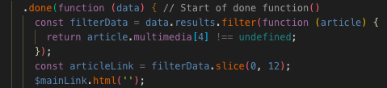
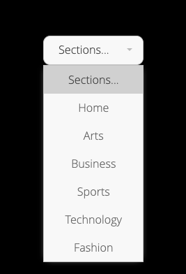

# Instanews App | Project 03

## index.html 

Personal learnings: 
- Adding html text to the webpage doesn't only have to be written in index.html, jQuery can also do this.
- Having a clean, indented html is important due to a better visualization of the webpage as well as having a better grasp of what every element's purpose is.
- Adding alt attributes and meta tags (with name="Description" and content="") helped boosted my SEO on Lighthouse Audits.
- Adding script tags to the bottom of the body tag is important because it lets the browser go through the markup language first before it reaches the back-end functions or script.js.

## _main.scss/stylesheet

Personal Learnings:
- Applying scss to Instanews made me realize the convenience of scss through it's unique style of nesting elements.
- Using @include to target tablet/desktop widths. 
- Designing a jQuery plug in requires a new a scss file (e.g. _selectrics.scss)

## script.js

Personal learnings: 
- Using the slice() and filter() methods gave me a better understanding of how the browser was grabbing each individual item from the API. 

- Adding multiple css styling to elements through jQuery is a huge hassle and it is better to use the addClass() methods and styling them later in _main.scss.
- Inserting a dynamic variable (category) in the New York Times URL was a useful part of the API process because it would automatically grab the right article images and texts from new york times according to what was clicked ( const category = $(this).val(); )

## Installations 

- Installed a jQuery plug in that gave my dropdown menu bar some styling which came with it. (This was also my stretch goal)

- This plug in requires that I add a given script tag on their webpage to the bottom of the body tag under my index.html.
- A new partials folder was an important asset of the plug in to add my own styling.
- Which also meant I had to include another @import tag in the styles.scss folder (@import 'partials/selectric';)
- Under _selectric.scss (the new partials folder) is where all the styling was added. 
 

